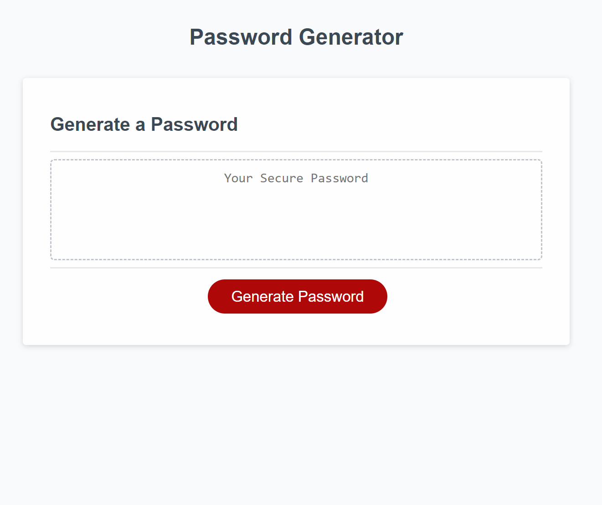

# challenge3
I built this website to further educate myslef on html, css, and javascript fundamentals.

## User Story
As a user I want to access this website to create a randomized password for authentification purposes. 

### Motivation
My motivation for completing this project is to learn more about html, css, and javascript.

#### Why
I did this because I believe this will help me learn and allow users to generate random passwords.

##### Problem Solving
This website solves user problems of creating new passowrds by allowing the user to generate randomized passwords with little effor.

##### What did you learn?
I learned how to connect java script with html and css. I learned how to use var functions, arrays, array methods, objects, and object methods, for loops, basic boolean logic, and console.log(). 

##### You can view a mock up below: 

##### You can find a link to the project below:
Link to githubrepo:
https://github.com/precisecoding/challenge3

Deployed link:
https://precisecoding.github.io/challenge3/
##### This site was built using github pages.
https://pages.github.com/

##### Thanks to everyone for support and contributions!

##### Sources used:
https://developer.mozilla.org/en-US/, https://www.w3schools.com/, https://stackoverflow.com/. Worked with tutor, Cody Junier from DU Whow was helpful along with TA George Yoo.

